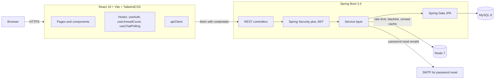

# Campus Secondhand Marketplace

A campus-bound secondhand marketplace for University of Waikato students. List, browse, message, and trade — gated to `@students.waikato.ac.nz` so every conversation happens between verified peers.

Built as a thesis project to explore how a small, opinionated stack — Spring Boot, React, JPA, Redis — can deliver a production-shaped MVP with strong test coverage and a documented engineering trail.

| | |
|---|---|
| **Status** | Milestones 1–5 complete · Milestone 6 (polish) in progress |
| **Backend tests** | 157 unit + integration (JUnit 5, Mockito, Testcontainers) |
| **Frontend tests** | 14 unit (Vitest) + 22 E2E (Playwright) |
| **Engineering log** | 65 numbered decisions in `docs/engineering-journal.md` |
| **License** | MIT — see [`LICENSE`](LICENSE) |

---

## What it does

- **Campus-only auth** — registration validates the email domain server-side; tokens are JWTs in `HttpOnly` cookies with logout revocation via Redis blacklist.
- **List items** — title, description, category, condition, price (or giveaway), single image upload, status lifecycle (Available → Reserved → Sold, plus Removed).
- **Public browse + search** — keyword, category, listing type (sell/giveaway), sort by date or price, server-side pagination, URL-driven filters.
- **Messaging** — buyer initiates a conversation from a listing detail page; cursor-based message pagination, unread counters, visibility-aware polling, optional browser notifications.
- **Owner controls** — edit, change status, soft delete, with the public detail view hiding mutation controls for non-owners.
- **Rate limiting** — login, registration, password reset, and message sending are rate-limited per IP / per user via Redis token buckets.

For the full feature scope (and what is intentionally out of scope) see [`docs/mvp-scope.md`](docs/mvp-scope.md).

---

## Architecture



### Module layout

```
.
├── backend/                      Spring Boot 3.4 service
│   ├── src/main/java/.../        controllers, services, repos, entities
│   └── src/test/java/.../        157 tests (unit + integration)
├── frontend/                     Vite SPA
│   ├── src/                      pages, components, hooks, api, auth
│   ├── e2e/                      Playwright specs (22 tests)
│   └── e2e/helpers/              ESM-safe path + Redis flush helpers
├── infra/
│   └── docker-compose.yml        MySQL + Redis for local dev
└── docs/
    ├── dev-roadmap.md            Milestones 1..6
    ├── mvp-scope.md              In/out of scope
    ├── engineering-journal.md    65 decisions (D-1..D-65)
    ├── manual-e2e-epic*.md       Manual UAT checklists
    ├── project-structure.md      File-by-file inventory
    └── superpowers/              Specs and plans per epic
```

---

## Quick start

### Prerequisites

| Tool | Version |
|---|---|
| JDK | 21+ |
| Node | 20+ |
| Docker + Compose v2 | latest |

### Run it locally

```bash
# 1. Start MySQL + Redis
cd infra
docker compose up -d

# 2. Backend (port 8080)
cd ../backend
./mvnw spring-boot:run

# 3. Frontend (port 5173)
cd ../frontend
npm install
npm run dev
```

Open <http://localhost:5173>. Register with any `@students.waikato.ac.nz` address (the domain check is the only campus-gate; emails are not actually sent in dev — password-reset tokens are logged to the backend console).

Once the backend is running you can also browse the auto-generated API documentation at:

- **Swagger UI** — <http://localhost:8080/swagger-ui/index.html>
- **OpenAPI JSON** — <http://localhost:8080/v3/api-docs>

The cookie-based auth scheme is documented in the schema; click the *Authorize* button after logging in via `/api/auth/login` to try authenticated endpoints from the UI.

### Stopping

```bash
# Kill backend / frontend with Ctrl+C in their terminals, then:
cd infra && docker compose down
```

---

## Testing

```bash
# Backend (Maven, JUnit 5, Testcontainers spins MySQL on demand)
cd backend && ./mvnw test

# Frontend unit tests (Vitest, jsdom)
cd frontend && npm run test

# Frontend E2E (Playwright, requires backend + frontend + Docker stack running)
cd frontend && npm run e2e
```

The E2E suite resets Redis rate-limit counters between tests via a `docker exec` helper (see `frontend/e2e/helpers/rateLimit.ts`); make sure the `infra/docker-compose.yml` stack is up and the container is named `campus_redis` (the default).

---

## Tech stack

**Backend** Java 21 · Spring Boot 3.4 · Spring Security · Spring Data JPA · MySQL 8 · Redis 7 · JJWT · Spring Mail · Bean Validation · Testcontainers

**Frontend** React 19 · React Router 7 · Vite 8 · TailwindCSS 4 · Vitest · Playwright

**Infrastructure** Docker Compose · MySQL 8 · Redis 7 (token-bucket rate limit, JWT blacklist, unread cache)

---

## Documentation index

| Document | Why you'd read it |
|---|---|
| [`docs/dev-roadmap.md`](docs/dev-roadmap.md) | Milestone plan and current progress |
| [`docs/mvp-scope.md`](docs/mvp-scope.md) | What this MVP intentionally does and does not include |
| [`docs/engineering-journal.md`](docs/engineering-journal.md) | Numbered decision log — every non-trivial design choice with rationale, trade-offs, and lessons (currently D-1..D-65) |
| [`docs/project-structure.md`](docs/project-structure.md) | File-by-file inventory: which class does what and which milestone introduced it |
| [`docs/manual-e2e-epic1.md`](docs/manual-e2e-epic1.md) | Manual UAT checklist for auth (epic 1) |
| [`docs/superpowers/specs/`](docs/superpowers/specs/) | Per-epic design specs |
| [`docs/superpowers/plans/`](docs/superpowers/plans/) | Per-epic implementation plans |

---

## Project status & roadmap

| Milestone | Scope | Status |
|---|---|---|
| **M1** | Auth & accounts (JWT cookies, registration, login, password reset, rate limit) | ✅ |
| **M2** | Listings CRUD + image upload + ownership-aware detail | ✅ |
| **M3** | Public browse, search, filter, pagination | ✅ |
| **M4** | (Browse polish — folded into M3) | ✅ |
| **M5** | Messaging (conversations, messages, unread, polling) | ✅ |
| **M6** | Polish, testing, deployment | 🚧 in progress |

See `docs/dev-roadmap.md` for the full list and `docs/engineering-journal.md` for the running decision log.

---

## Acknowledgements

University of Waikato — School of Computing & Mathematical Sciences. Thesis project, 2026.
