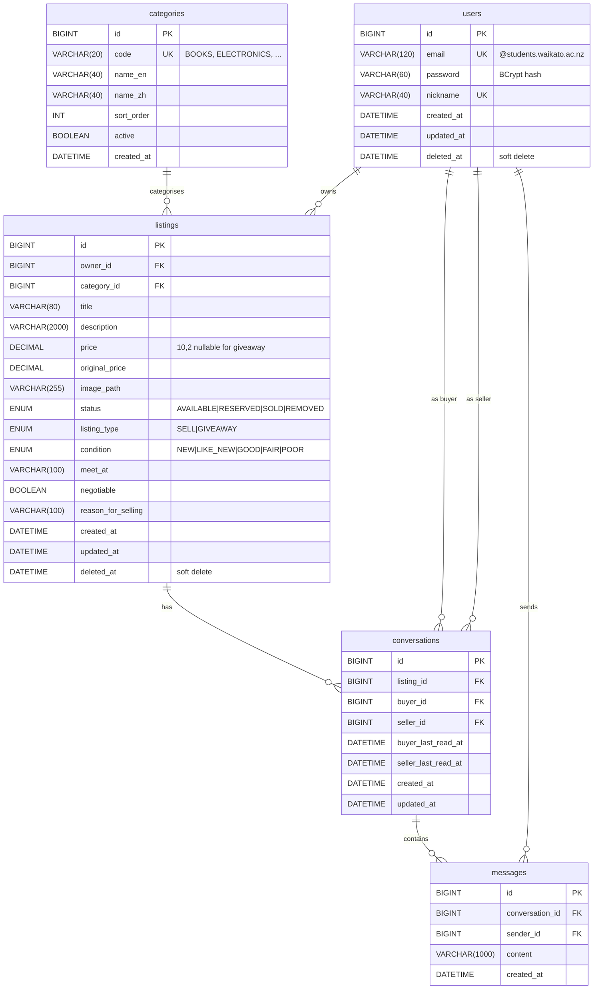
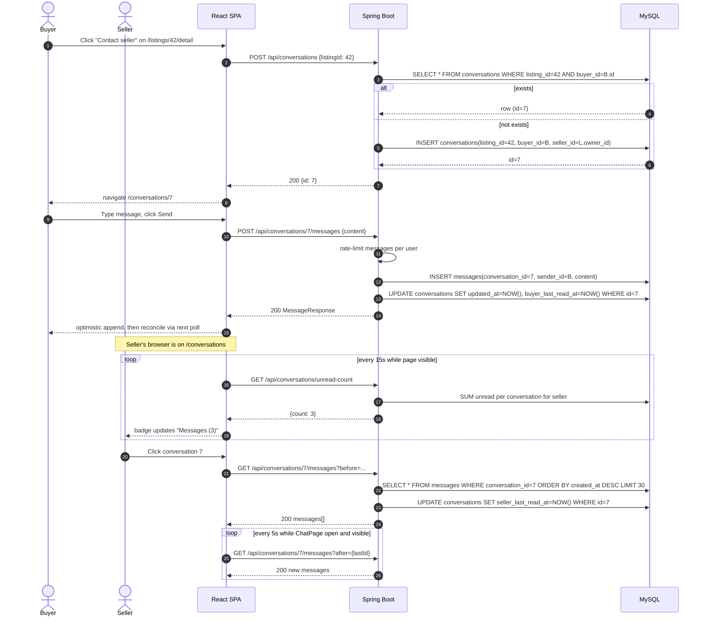

# Architecture

System-level diagrams for the Campus Secondhand Marketplace. Auto-generated REST API documentation lives at `/swagger-ui/index.html` once the backend is running; this document covers the parts Swagger does not — the persistence model and the sequence of interactions across the front end, back end, MySQL, Redis, and the user.

---

## 1. Entity-Relationship diagram

Five tables. JPA-annotated entities live in `backend/src/main/java/nz/ac/waikato/campusmarketplace/entity/`. Soft-delete columns (`deleted_at`) on `users` and `listings` are filled in at the service layer; the database itself does not enforce them. All time columns are MySQL `DATETIME` populated from `LocalDateTime` and managed via `@PrePersist` / `@PreUpdate` callbacks.



### Key constraints and indexes

- `users.email` — unique. Domain check is enforced in the service layer (`@students.waikato.ac.nz`), not by a DB constraint.
- `users.nickname` — unique.
- `conversations` — `UNIQUE(listing_id, buyer_id)` so a buyer cannot open two conversations on the same listing; `createOrGetConversation` relies on this.
- `messages` — composite index `(conversation_id, created_at)` to support cursor-based pagination ordered by recency.
- `listings` — separate indexes on `owner_id`, `status`, `created_at`, `image_path` to support the four common query shapes (my listings, browse-by-status, browse-newest, image lookup).

### Why no `password_reset_tokens` table?

Reset tokens are stored in **Redis**, not MySQL — they are short-lived (15 min TTL) and high-cardinality, so a key/value store with native expiration is a better fit than a row that needs cleanup. See decision **D-21** for the trade-off.

### Why no `jwt_blacklist` table?

Logout works by adding the token's `jti` claim to a Redis set with TTL equal to the token's remaining validity. Same reasoning as above — see **D-15**.

---

## 2. Authentication sequence

JWT-in-HttpOnly-cookie auth, with a Redis blacklist for logout revocation and a Redis token-bucket for rate limiting.

```mermaid
sequenceDiagram
    autonumber
    actor U as User (browser)
    participant FE as React SPA
    participant API as Spring Boot
    participant DB as MySQL
    participant R as Redis

    U->>FE: Submit /register form
    FE->>API: POST /api/auth/register {email, password, nickname}
    API->>R: INCR rate-limit:register:{ip}
    alt rate exceeded
        API-->>FE: 429 RATE_LIMITED
        FE-->>U: "Too many registrations..."
    else within limits
        API->>API: validate email domain, password rules
        API->>DB: INSERT user (BCrypt hash)
        API->>API: signJwt({sub, jti, exp})
        API-->>FE: 200, Set-Cookie: token=...; HttpOnly; SameSite=Lax
        FE-->>U: redirect /
    end

    Note over U,R: Subsequent authenticated request
    U->>FE: Click /listings/mine
    FE->>API: GET /api/listings/mine (cookie attached)
    API->>API: JwtAuthenticationFilter parses cookie
    API->>R: SISMEMBER jwt:blacklist {jti}?
    alt blacklisted (logged out)
        API-->>FE: 401 UNAUTHORIZED
    else valid
        API->>DB: SELECT * FROM listings WHERE owner_id = ?
        API-->>FE: 200 ListingResponse[]
    end

    Note over U,R: Logout
    U->>FE: Click "Log out"
    FE->>API: POST /api/auth/logout
    API->>R: SADD jwt:blacklist {jti} EX={remaining_ttl}
    API-->>FE: Set-Cookie: token=; Max-Age=0
```

**Why JWT in HttpOnly cookie rather than localStorage?** XSS resistance — JavaScript on the page cannot read or steal the token. The trade-off is CSRF, mitigated by `SameSite=Lax` plus the API ignoring `application/x-www-form-urlencoded` requests (see **D-9**).

---

## 3. Messaging sequence — buyer contacts seller

The "Contact seller" button on a listing detail page either creates a new conversation or returns the existing one (`UNIQUE(listing_id, buyer_id)` is the idempotency anchor). Then both sides poll for new messages and unread counts.



**Why polling rather than WebSocket?** MVP scope and observability. Polling is trivial to test, debug, and reason about; WebSocket adds a long-lived connection lifecycle, reconnect logic, and another moving piece in the load picture. Listed as future work in `docs/mvp-scope.md`.

**Visibility-aware** — `useUnreadCount` and `useChatPolling` both pause when `document.visibilityState === 'hidden'` to avoid burning battery and DB cycles on a backgrounded tab. See **D-58** / **D-60**.

---

## 4. File layout reference

For the file-by-file inventory see [`project-structure.md`](project-structure.md). For decisions made along the way see [`engineering-journal.md`](engineering-journal.md). For the milestone arc see [`dev-roadmap.md`](dev-roadmap.md).
